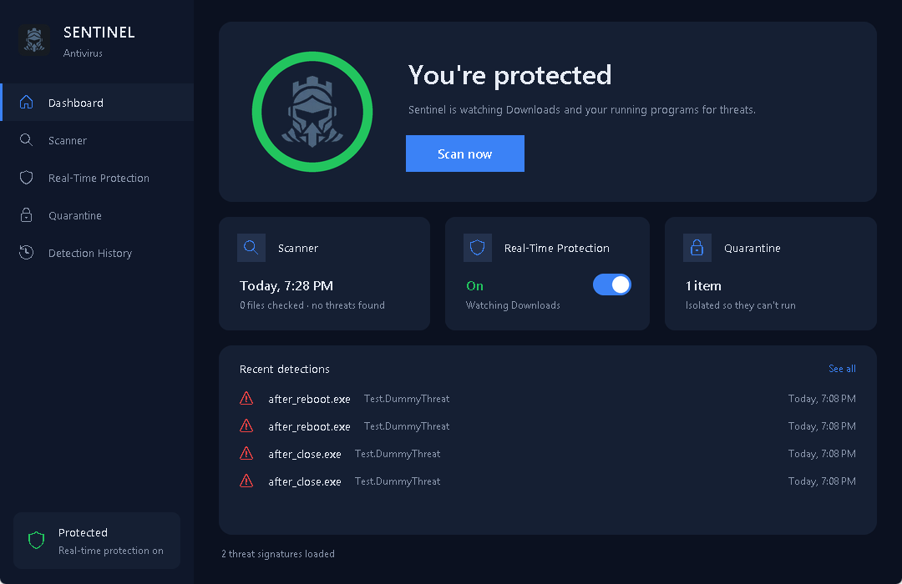
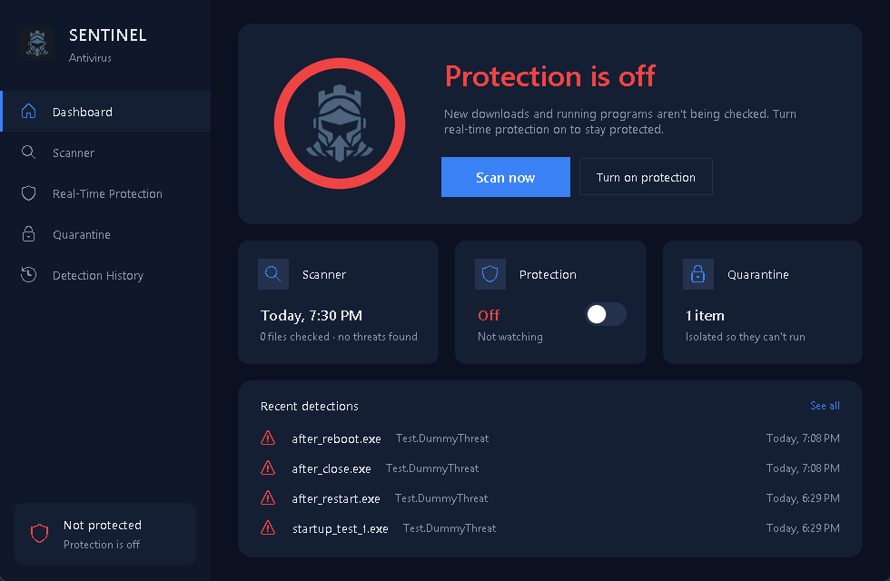
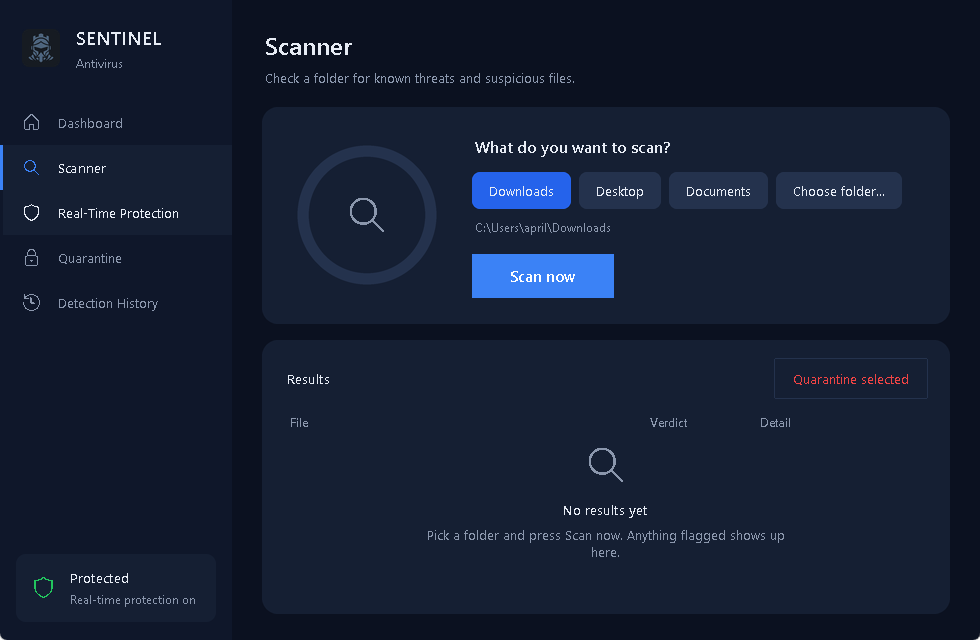
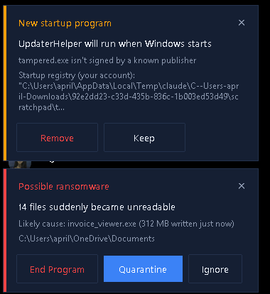

# Sentinel Antivirus

<p align="center">
  <a href="https://github.com/willischilling/sentinel-antivirus/releases/latest/download/SentinelSetup.exe"></a>
</p>

<p align="center">
  <b>Windows 10 / 11, 64-bit.</b> Click the button, run <code>SentinelSetup.exe</code>, done.<br>
  Don't use the green <b>Code → Download ZIP</b> button. That's the source code, not the app.<br>
  Windows SmartScreen will warn because the installer isn't code-signed: click <b>More info → Run anyway</b>.
</p>

A Windows antivirus built from scratch in Python: an on-demand scanner, real-time protection that keeps running in the background, behavior monitoring, and a desktop app with its own installer.

Sentinel checks files against over a million real malware fingerprints and about 10,700 YARA rules, looks inside archives, verifies publisher signatures, and watches for programs adding themselves to startup and for ransomware-like activity.

> **This is a portfolio / learning project, not a replacement for Microsoft Defender.** It has no kernel driver, so it reacts to threats rather than blocking them before they run. Keep Defender on. See [Limitations](#limitations).



| Protection off | Scanner | Behavior alerts |
|---|---|---|
|  |  |  |

## Features

### Detection
Every file goes through these layers, strongest first:

1. **Known malware fingerprints.** SHA-256 hashes from two abuse.ch feeds:
   - [MalwareBazaar](https://bazaar.abuse.ch/): the full history of over 1.1 million samples, plus a rolling feed of the last 48 hours with malware family names (for example "Mirai (MalwareBazaar)").
   - [ThreatFox](https://threatfox.abuse.ch/): payloads seen in active attack campaigns (AsyncRAT, RedLine, Akira ransomware, fake browser updates...). Only entries rated 75% confidence or higher are used, which adds about 7,000 fingerprints MalwareBazaar doesn't have.
2. **YARA rules.** The [YARA Forge](https://github.com/YARAHQ/yara-forge) "extended" rule set (about 10,700 curated rules; tested with no false alarms on 2,196 Windows, Program Files and Downloads files), which detects whole malware families rather than single files. Rules with a score of 70 or more count as a threat; lower scores count as suspicious.
   Large files (over 2 MB) only get the YARA pass if they're programs, scripts, or start like an archive, Office file or PDF. Logs, game data and fonts still get the fingerprint check.
3. **Archive contents.** Files inside an archive have their fingerprints checked in batches, and ordinary data files (like the thousands of `.class` files in a Java `.jar`) are YARA-scanned together, so large archives take a fraction of a second instead of several. Low-score YARA hits on the archive file itself are ignored, since those rules would be matching compressed bytes; the files inside are what get checked.
   ZIP and JAR are read in memory. 7-Zip, RAR, TAR, CAB and ISO files are listed and extracted with Windows' own Microsoft-signed `tar.exe` (libarchive), so no third-party tools are bundled. Archives inside archives are followed up to two levels deep, across formats.
4. **Heuristics.** Suspicious strings (encoded PowerShell, process-injection APIs, shadow copy deletion...), double extensions like `invoice.pdf.exe`, and obfuscated scripts. The string checks only apply to files that can actually run (programs, scripts, shortcuts, macro-enabled Office files). A log or document that merely *mentions* `powershell -enc` is harmless.

Sentinel never reports its own files. Its data and quarantine folders are skipped, and YARA isn't run against YARA rule files, since they always contain the very strings they look for.

**Publisher signature check.** Weak signals (heuristics and low-score YARA hits) are dropped for files with a valid Authenticode signature, verified with Windows' own `WinVerifyTrust`. This covers both embedded signatures and the catalog signatures most Windows system files use. A signed file with even one byte changed fails the check. Known-malware fingerprints and strong YARA hits still apply to signed files, since malware is occasionally signed with stolen certificates.

**Archive safety limits:**
- Contents are checked against size and compression-ratio limits before anything is extracted, so archive bombs are flagged without being expanded.
- A program hidden inside a password-protected archive is flagged as suspicious. RAR archives with encrypted file names are flagged too.

### Real-time protection
This runs as a separate background process (`Sentinel.exe --agent`), so it keeps going after the window is closed. It stops only when you switch it off. If it was on when the computer shut down, it comes back at the next sign-in.

| Layer | What it does |
|---|---|
| Download protection | Scans new files in the watched folder (Downloads by default) as soon as they finish downloading. |
| Program protection | Checks each new program within about a second of it starting, plus a background sweep of everything already running. |
| Startup protection | Alerts when a program adds itself to the registry Run keys, a Startup folder, or Task Scheduler. Programs with a valid Microsoft signature (Edge, Windows components) are logged without a popup, except launchers like PowerShell, cmd and rundll32, which malware often hides behind. |
| Ransomware protection | Watches Documents, Desktop, Pictures, Music, Videos and Downloads for many files suddenly turning into unreadable data or being renamed to strange extensions. The optional **Ransomware shield** (below) goes further and blocks changes before they happen. |
| USB drive protection | Scans USB drives and SD cards as soon as they're plugged in, at background priority (or asks first, or is off). Threats get the usual popup, and a clean drive gets a short "no threats" note. |

**Alerts.** These appear as popups in the bottom-right corner, with buttons to act on them:
- Quarantine or Delete a file.
- End a running program, or End and quarantine it.
- Remove or Keep a startup entry or scheduled task.

Nothing is ended or deleted without a click.

**Game mode** (on by default, in Settings): while a game or video is full screen, Sentinel holds its popups and puts off scheduled scans and USB auto-scans until you're done, then shows what it held. It checks what Windows reports (`SHQueryUserNotificationState`) and whether the window in front covers its whole monitor, which catches borderless games too. Threats are still logged right away, and a program already running as a known virus or ransomware-like activity always alerts immediately.

**Ransomware shield.** An on/off switch for Windows' own **Controlled folder access** (part of Microsoft Defender), opened from the Ransomware protection row. When it's on, only apps Microsoft trusts, and ones you allow, can change files in Documents, Pictures, Videos, Music and Desktop, plus any folders you add. Anything else, like ransomware, is blocked by Windows before a single file changes.
- Apps Windows blocked in the last 30 days are listed (read from Defender's event log), each with an **Allow** button, for games that can't save.
- Sentinel allows itself, so it can still quarantine threats from protected folders.
- Every change goes through one admin prompt. What Sentinel changed is recorded in an admin-only folder, and uninstalling undoes exactly that.
- It needs Microsoft Defender to be the active antivirus; with another antivirus, the page says so.

**Programs running as administrator.** If Windows blocks an action (ending a program that runs as administrator or SYSTEM, moving a file out of Program Files, removing an all-users startup entry or task), Sentinel shows the normal Windows admin prompt. After you click Yes, a one-shot `Sentinel.exe --elevated` process does just that action and exits. Sentinel never stays elevated. It's installed in your user folder, so a permanently elevated Sentinel would let any program that replaced its files gain admin rights. Before ending a program, the elevated step checks that the process ID still belongs to the same file.

**Ransomware alerts** name the program most likely responsible: the process writing the most to disk right now. The alert says "Cause" instead of "Likely cause" when that process also has files open in the affected folder.

**Threat database updates.** The fingerprint list and YARA rules update automatically every 6 hours. The first download is about 45 MB; later updates take a few seconds.

### Ask Sentinel (scam checker)
A chat tab for weird messages, sketchy links and security questions. It works in two layers:

1. **Built-in checks**, instant and offline. Every link is looked up in about 390,000 known phishing domains ([Phishing.Database](https://github.com/Phishing-Database/Phishing.Database)) and the live [URLhaus](https://urlhaus.abuse.ch/) and [OpenPhish](https://openphish.com/) lists, which update with the threat database. Links are also checked for:
   - brand look-alikes (`roblox-free-rewards.xyz`, `paypa1-secure.com`)
   - disguised characters (punycode), bare IP addresses and link shorteners
   - cheap throwaway domain endings, and links that download programs

   The message text is checked for gift-card and prize scams, requests for passwords or codes, remote-access tools, fake tech support, urgency and non-refundable payments. Shared hosting sites like sites.google.com are never flagged as a whole.
2. **A local AI** that explains the result in plain words, in the app's language. It's [Qwen3 4B](https://huggingface.co/Qwen/Qwen3-4B-GGUF) (Apache 2.0), run by [llama.cpp](https://github.com/ggml-org/llama.cpp) **on your PC**: no account, no API key, and nothing you type leaves the computer.
   - It gets the built-in check results as facts, so it doesn't have to guess about links.
   - The model is a one-time 2.5 GB download from a pinned Hugging Face revision, verified against its SHA-256, and it can resume if interrupted.
   - It loads on the first question and unloads after 5 idle minutes to free about 3 GB of memory. Answers stream in, typically in 5 to 15 seconds.

Without the AI download, the built-in checks still work on their own.

### Sentinel VPN
A VPN tab with an on/off switch, the server's location on a world map, and your current public IP.

- **Servers:** it uses [Proton VPN](https://protonvpn.com/)'s free servers (no-logs, based in Switzerland). Make a free Proton account, download a WireGuard config for Windows, and import the `.conf` file. Any other WireGuard config works too.
- **Engine:** the official [WireGuard for Windows](https://www.wireguard.com/install/). If it's missing, Sentinel downloads the MSI from download.wireguard.com and only installs it after confirming it's signed by *WireGuard LLC*.
- **One admin prompt, once.** Setup installs WireGuard if needed and stores the config (which holds the tunnel's private key) in `%ProgramData%\Sentinel Antivirus\vpn`, readable only by Windows and administrators. It then creates the tunnel service, set to start only when asked, and gives your Windows account permission to start and stop it. After that the switch works with no prompts.
- **No leaks:** when the config routes all traffic (`0.0.0.0/0`), WireGuard blocks anything trying to go around the tunnel. Configs that run commands (`PostUp` and similar) are refused.
- **Automatic VPN:** the background agent reads the current Wi-Fi connection through Windows' native Wi-Fi API (`wlanapi.dll`).
  - It turns the VPN on by itself when you join an **open (no-password) network**, or, if you choose, any network you haven't marked as trusted.
  - A popup says why, with **Disconnect** and **Trust this network** buttons.
  - Your home network is never switched on automatically unless you pick the "any untrusted network" option.
- **IP and location:** looked up with [ipwho.is](https://ipwho.is/), which sees only the request itself, the same as any website you visit.
- **Clean up:** **Remove VPN** in the tab, or uninstalling Sentinel, deletes the tunnel and its config with one admin prompt. WireGuard itself stays installed.

### Web protection
Blocks scam, phishing and malware websites in every browser and app, by sending Windows' website lookups (DNS) through a free filtering service:

- **Standard (recommended):** [Quad9](https://quad9.net/), a Swiss non-profit that blocks malware and phishing domains and doesn't log IP addresses.
- **Family:** [Cloudflare for Families](https://one.one.one.one/family/), which also blocks adult sites.

How it works:
- **Turning it on** sets the DNS servers of the PC's physical network adapters, after one admin prompt.
- **Turning it off** puts each adapter back exactly as it was, automatic (from the router) or a fixed address. Those previous settings are saved in an admin-only folder.
- **"Check it's working"** looks up the provider's own test site, which is only blocked when the filter is really in use. That catches a router or another app overriding it.
- **"Apply again"** appears if a network adapter isn't using the filter.
- **Uninstalling Sentinel** turns it off too.

### Firewall
A control panel for the built-in **Windows Firewall**, a real kernel-level filter. Sentinel doesn't add a firewall of its own.

- **Overview:** whether the firewall is on, whether incoming and outgoing connections are blocked, and whether your current network is marked Public or Private. There's a **Turn on firewall** button if it's ever off.
- **Modes:**
  - **Standard (recommended):** blocks incoming connections; apps can go out unless you block them.
  - **Lockdown:** blocks all network traffic, in and out, for when you think the PC is infected. It works by adding a block-everything rule, because in Windows' firewall a block rule beats every allow rule.
- **Blocked apps:** pick any program to cut it off from the network in both directions, and unblock it later. Windows' own programs can't be blocked here, because that could break Windows.
- **How it's built:** changes go through Windows' firewall interface (`HNetCfg.FwPolicy2`), and each one shows the Windows admin prompt. The admin side only accepts these fixed actions, with checked arguments.
- **Easy to find:** every rule Sentinel creates is in the "Sentinel Antivirus" group, so you can see them in Windows' own firewall settings.
- **Clean up:** uninstalling Sentinel removes all of its rules and turns Lockdown off, together with the VPN cleanup, in one prompt.

### Scheduled scans and app updates
- **Scheduled scans:** set on the Scanner page (off, daily or weekly, at a chosen time). The background agent quietly scans Downloads, Desktop and Documents at a lower CPU and disk priority. A scan missed while the PC was off runs at the next sign-in. Anything found gets the usual popup, and clean scans just update "Last scan".
- **Out-of-date apps:** out-of-date apps are one of the most common ways into a PC. The Updates tab lists every app Windows' package manager ([winget](https://learn.microsoft.com/windows/package-manager/)) knows a newer version of, using only the `winget` source, whose installers are verified by hash. Each app gets an **Update** button, and there's an **Update all**.

### Security Check and password leak check
- **Security score:** out of 100, shown on the dashboard and broken down on the Security Check page. Each item is weighted:
  - real-time protection 20, Windows Firewall 15
  - threat database fresh, Microsoft Defender, web protection, apps up to date: 10 each
  - Sentinel up to date, scheduled scans, a scan in the last week, start with Windows, Windows' admin prompts (UAC): 5 each

  Anything that needs attention comes first, with a **Fix** button. Items Sentinel can't check don't count against the score.
- **Password leak check:** tells you if a password appears in a known data breach, using [Have I Been Pwned](https://haveibeenpwned.com/Passwords)' free Pwned Passwords service and its *k-anonymity* model.
  - The password is hashed (SHA-1) on the PC, and only the first 5 characters of that hash are sent, with padding requested.
  - The match is found locally among the hundreds of results that come back.
  - The password is never sent, saved or logged, and the text box is cleared after each check.

### Tools
A Tools tab with four utilities:

- **Browser extension checker.** Lists every extension in every profile of Chrome, Edge, Brave, Vivaldi, Opera, Opera GX and Firefox, riskiest first, with a **Manage** button that opens the browser's page for it.
  - **Known bad:** on [Malicious Extension Sentry](https://github.com/toborrm9/malicious_extension_sentry) (MIT, updated daily), about 6,800 Chrome and Edge extensions pulled from the stores for malware, spyware, adware, search hijacking or policy violations. It updates with the threat database. Also flagged: anything the browser itself has blocklisted, and sideloaded extensions containing files that match known malware fingerprints.
  - **Risky:** installed from outside the web store (loaded from a folder, the command line or a policy, the usual way adware and stealers sneak extensions in) with access to every website or to sensitive features.
  - **Wide access:** from the store, but can read and change every website, or has several sensitive permissions (cookies, web traffic, debugger, native messaging...). Normal for ad blockers and password managers.
  - Only the ID list is downloaded; nothing about your extensions leaves the PC.
- **Junk cleaner.** Shows how much each category would free and cleans the ones you pick: temporary files (older than a day), browser caches, app caches (Discord, Spotify, Steam, Epic Games, Roblox, Teams), crash reports, and optionally the Recycle Bin and the recent-files list.
  - Only those fixed folders are touched. Passwords, cookies, history and bookmarks are never deleted.
  - Folder links (junctions) are never followed, files in use are skipped, and apps that are running are left alone, with a note to close them.
  - Windows Update leftovers are handled by Windows' own Disk Cleanup, one click away.
- **Recovery checklist.** Password stealers (RedLine, Lumma, Vidar...) copy saved passwords, sign-in cookies, Discord tokens and crypto wallets within seconds, so quarantining them isn't the end of it. When Sentinel finds one (or a remote-access trojan like AsyncRAT), in a scan or in real time, the dashboard shows a banner and the scan summary a **What to do now** button. The checklist walks through the steps in the order that matters: clean up, a second opinion from Defender, email password first (from another device), browser passwords (it names the browsers that have saved passwords, reading only a count), signing out of other devices with direct links, 2FA, bank and crypto, and the leak check. Progress is saved; you can also open it any time.
- **Camera & microphone.** Windows records when each app starts and stops using the webcam or microphone (the data behind the taskbar's camera/mic icon, under `CapabilityAccessManager\ConsentStore`). The background agent reads it every 2 seconds and pops up an alert the moment an app turns either one on: the app, whether it's signed and by whom, and **End program** / **Always allow**. The page shows what's in use right now and what used them recently. Signed apps (voice chat in a game) wait for Game mode; unsigned ones don't.
- **Wi-Fi devices.** Lists every device on your home network with its maker (from the IEEE's registry of network-card makers, cached for 30 days), the name your router gives it, and what kind of device it probably is. Phones using a random private address are shown as such.
  - To find devices, a tiny UDP packet goes to each address in your /24 subnet, which makes Windows look each one up (ARP); every device that's there answers, even ones that ignore the packet. Only your own network, only when you ask.
  - **Router checks:** Telnet or FTP open (old unencrypted remote access), and UPnP on.
  - **New-device alerts:** afterwards, the agent only reads Windows' ARP table once a minute (nothing is sent) and pops up when a device it hasn't seen joins. A network seen for the first time is learned quietly.
- **Browser guard.** Watches where browser hijackers make their changes: browser policies for Chrome, Edge, Brave and Firefox (per user and all users: forced homepages, search engines, extensions, proxies, the "Managed by your organization" trick), the Windows hosts file, and Windows' proxy settings. Checked every 30 seconds. A change pops up with **Undo** or **Keep**; the page lists anything currently set, with **Remove**. Policy and hosts-file changes need the admin prompt, because only administrators can make them, which also means a hijacker needed admin rights too.
- **File shredder.** Overwrites each file with random data (flushed to disk), renames it, truncates it and deletes it, from the Tools tab or the right-click menu (**Shred with Sentinel**, always with a confirmation). One pass is what NIST SP 800-88 considers enough for hard drives; on SSDs and USB sticks the drive may keep copies out of any program's reach, and the app says so. Windows folders, program folders, drive roots and the user folder are refused, and folder links are never followed.
- **Password leak check** (see above).

### Desktop app
- A dashboard with protection status, last scan, quarantine count, recent detections and threat database status.
- A scanner for Downloads, Desktop, Documents, **all drives** or any folder, with an animated progress ring and a **Stop** button. A stopped scan keeps what it found.
- **Automatic updates:** new versions install in the background (checked every 6 hours) when the window is closed and no game is running. The download is checked against GitHub's SHA-256 first, the installer runs with no window (`--update --quiet`), and only the background protection comes back afterwards, with a short "Sentinel updated" popup. It can be turned off in Settings.
- **Right-click scanning:** "Scan with Sentinel" in File Explorer's menu for files, folders and drives (per-user registry entry, no admin needed; on Windows 11 it's under *Show more options*). Selecting several items scans them together. It can be turned off in Settings.
- Quarantine: files are moved to an isolated folder and renamed so they can't run, and can be restored or permanently deleted.
- Detection history.
- A system tray icon, and an option to start with Windows.
- **One-click updates:** the Update tab checks GitHub for a newer release. **Update now** downloads the installer, checks it against the SHA-256 GitHub publishes (a file that doesn't match is deleted, never run), and installs it automatically. Your settings are kept and Sentinel reopens by itself. A dot on the tab shows when an update is available.
- **Light and dark mode:** choose Dark, Light or Match Windows (follows the Windows setting, even when it changes). It switches instantly, and the popups and window title bar follow too.
- **Five languages:** English, 简体中文 (Chinese), हिन्दी (Hindi), Español and Français. Sentinel starts in your Windows display language when it's one of these. You can change it on the Settings page or in the installer, and the whole app switches instantly: popups, the tray menu, the activity log and the uninstaller too. Dates, times and numbers use each language's local format.
- Opening Sentinel while it's already running brings up the existing window instead of starting a second copy.

### Installer
`SentinelSetup.exe` installs for the current user only, so no admin rights are needed. It has a language picker, and it:
- adds Start Menu and desktop shortcuts
- adds an entry to Windows' Apps list with a working uninstaller
- can start protection when you sign in (optional)

## Getting started

### Download
**[Download SentinelSetup.exe](https://github.com/willischilling/sentinel-antivirus/releases/latest/download/SentinelSetup.exe)** from the latest release. The [release notes](https://github.com/willischilling/sentinel-antivirus/releases/latest) include a SHA-256 checksum for verifying the download. There's also the [website](https://willischilling.github.io/sentinel-antivirus/).

The installer isn't code-signed, so Windows SmartScreen will warn you: click **More info → Run anyway**.

`installer/installer.py` is the installer's *source code*. Running it directly won't install anything, because the app files are only packed in when `SentinelSetup.exe` is built.

### Requirements
- Windows 10 or 11. Scanning 7-Zip and RAR needs a recent Windows 11 `tar.exe`; everything else works on Windows 10.
- Python 3.11 or newer. It was developed on Python 3.13.

### Run from source
```bash
pip install -r requirements.txt
python gui.py
```

When run from source, all data (database, quarantine, settings, activity log) lives in `data/` and `quarantine/` inside the project folder. The installed app stores it in `%LOCALAPPDATA%\Sentinel Antivirus`.

The first time real-time protection is on, the background process downloads the threat database. You can also start this from the dashboard with **Update now**.

### Build the installer
```bash
pip install pyinstaller
powershell -ExecutionPolicy Bypass -File build_installer.ps1
```
This produces:
- `dist\Sentinel\`: the app, built with `--onedir` so it starts quickly
- `dist\Uninstall.exe`
- `dist\SentinelSetup.exe`: the installer, which bundles the other two. Releases publish it as an asset rather than committing it to the repo.

### Command line
There's also a basic CLI (`cli.py`) that uses the same scanning engine:
```bash
python cli.py scan C:\Users\me\Downloads --quarantine
python cli.py procscan
python cli.py quarantine-list
python cli.py import-sigs my_hashes.txt    # lines of: <sha256> <name>
```

## How it works

```
gui.py ─────── main window (dashboard, scanner, quarantine, history)
  │             starts/stops the agent, shows its live activity
  │
  ├─ launcher.py ──────── spawns / signals the agent and the window
  ├─ single_instance.py ─ named mutexes + events (one window, one agent)
  │
agent.py ───── background protection (gui.py --agent)
  ├─ monitor/file_watcher.py ─────── new files in the watched folder
  ├─ monitor/process_watcher.py ──── new and running programs
  ├─ monitor/startup_watcher.py ──── Run keys, Startup folders, scheduled tasks
  ├─ monitor/ransomware_watcher.py ─ mass file encryption in personal folders
  ├─ toast.py / tray.py ──────────── popups and tray icon
  └─ core/threat_intel.py ────────── automatic threat database updates

core/
  scanner.py ───── runs the detection layers on a file
  signatures.py ── hashing;  database.py ── SQLite (fingerprints, history, quarantine, settings)
  yara_engine.py ─ compiled YARA rules;  archives.py ── archive scanning
  authenticode.py  publisher signature verification (WinVerifyTrust via ctypes)
  heuristics.py ── suspicious strings, double extensions, entropy
  quarantine.py, activity.py, settings.py, autostart.py, paths.py

installer/  ── setup wizard, uninstaller, shortcut creation
widgets.py, theme.py ── custom UI widgets (rounded cards, switches, rings) and colors
core/i18n.py, core/translations.py ── the 5 languages (about 250 phrases each), plurals and local formats
core/app_update.py ── checks GitHub for new releases, downloads and verifies the installer
ask_page.py, core/scam_check.py, core/link_intel.py, core/assistant.py ── Ask Sentinel: chat tab, built-in checks, link lists, local AI
vpn_page.py, core/vpn.py ── Sentinel VPN: the tab, and WireGuard setup/start/stop
firewall_page.py, core/firewall.py ── Firewall: Windows Firewall modes and blocked apps
webprotect_page.py, core/webprotect.py ── Web protection: DNS filtering (Quad9 / Cloudflare)
app_updates_card.py, core/app_updates.py ── Out-of-date apps via winget
core/schedule.py ── Scheduled quick scans
security_page.py, core/security_score.py, core/pwned.py ── Security Check: score, fixes, password leak check
core/usb.py, core/wifi.py ── USB drive detection; current Wi-Fi network (for automatic VPN)
theme.py ── dark and light palettes, swapped live
```

Design notes:
- **Two processes.** The window and the protection agent communicate through Windows named events and a shared activity log and SQLite database. That's why closing or quitting the window doesn't stop protection.
- **Responsive UI.** Scans run on worker threads and report back through a queue. The main thread drains that queue in small batches, so a burst of results can't freeze the window.
- **Compact fingerprint storage.** The 1.1 million fingerprints are stored as 32-byte blobs in a `WITHOUT ROWID` SQLite table. That keeps the database to about 50 MB with lookups around 1 ms.
- **Process check cache.** Each program's verdict is cached by path, modification time and size, and the cache is cleared when the threat database updates. A running program's file is only re-read when something has changed.
- **Antialiased UI.** Tk can't draw smooth curves on Windows, so rounded corners, switches and rings are drawn with Pillow at 4x size and scaled down.

## Testing notes

Everything was tested with harmless stand-ins, never real malware:
- **Signature matches:** a text file whose hash was added to the local list, and a copy of Windows' `ping.exe` registered the same way as a "known bad" running program.
- **YARA:** test rules that match marker strings.
- **Archives:** ZIP, RAR (made with WinRAR), 7z, TAR.GZ and ISO archives containing those stand-ins, including nested and password-protected ones.
- **Startup and task alerts:** a test registry key, a scratch folder, and a scheduled task set to run in 2099.

Measured results:
- **False positives:** none on 500 Windows System32 files or on 1,147 files in a real Downloads folder.
- **New-program check:** a known-bad program spotted about 0.5 seconds after starting; about 0.3% of one CPU core once settled.

## Limitations

- **No pre-execution blocking.** Blocking a program before it runs requires a Windows kernel driver. Sentinel detects and responds within about a second instead.
- **Brand-new malware can be missed.** If no fingerprint, YARA rule or heuristic covers it, it won't be caught.
- **Ransomware detection reacts after the fact.** It triggers after about 10 files are affected. The "likely cause" is a best guess based on disk activity, so check the name before ending a program. Bait files and automatic pausing of suspects were designed but left out because they couldn't be properly tested.
- **Download protection watches one folder** (Downloads by default).
- **Archive limits:** archives larger than 256 MB unpacked, and encrypted archive contents, can't be scanned inside.
- **Admin actions need your approval each time.** Sentinel runs as you, not as administrator. Ending a program that runs as administrator, or removing an all-users startup entry, shows the Windows admin prompt first. Core Windows processes (csrss, winlogon, lsass...) are never ended.

## Credits

- Malware fingerprints: [MalwareBazaar](https://bazaar.abuse.ch/) and [ThreatFox](https://threatfox.abuse.ch/) by abuse.ch
- YARA rules: [YARA Forge](https://github.com/YARAHQ/yara-forge), which packages rules from many open-source authors under their respective licenses
- Local AI: [Qwen3 4B](https://huggingface.co/Qwen/Qwen3-4B-GGUF) by the Qwen team (Apache 2.0), run with [llama-cpp-python](https://github.com/abetlen/llama-cpp-python)
- Link lists: [Phishing.Database](https://github.com/Phishing-Database/Phishing.Database), [URLhaus](https://urlhaus.abuse.ch/), [OpenPhish](https://openphish.com/)
- VPN: [WireGuard](https://www.wireguard.com/) and [Proton VPN](https://protonvpn.com/) free servers; world map from [Natural Earth](https://www.naturalearthdata.com/) (public domain)
- Libraries: [yara-python](https://github.com/VirusTotal/yara-python), [watchdog](https://github.com/gorakhargosh/watchdog), [psutil](https://github.com/giampaolo/psutil), [pystray](https://github.com/moses-palmer/pystray), [Pillow](https://python-pillow.org/), [PyInstaller](https://pyinstaller.org/)

Threat data is downloaded at runtime and not redistributed with the app. Only hash lists and rule text are downloaded, never malware samples.
